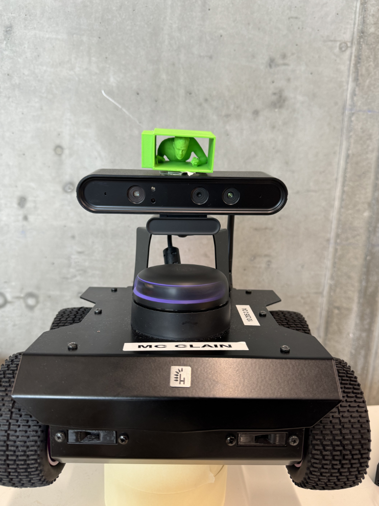
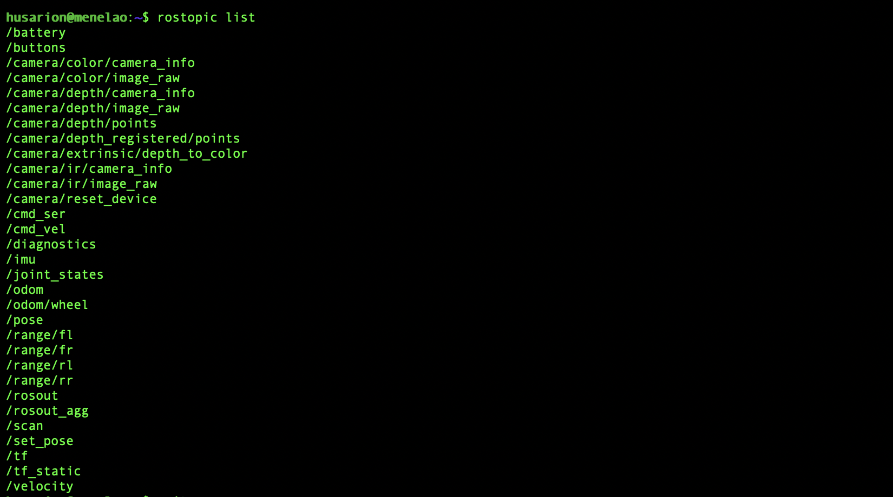

# Robocop Competition 2024


In this project we were tasked with programming a [Husarion Rosbot 2](https://husarion.com/robots/rosbot/)  that could navigate a map by following the line and find a target. The robot was required to be able to navigate the maze and recognize "Good" or "Bad" guys which are represented by images of fresh fruits. 


<div align="center"> 
  <a>
    
</a>
</div>

#  Video of the robot in action


#### Dependencies:
- [ROS Noetic](http://wiki.ros.org/noetic/Installation/Ubuntu) 
- Ultralytics-8.2.5 for the YOLO inference
```bash
pip install ultralytics
```

- gmapping for the odometry visualization in rviz


```bash
sudo apt install ros-noetic-slam-gmapping
```

## Steps to run the Project


### 1. Start the roscore inside the robot
```bash
export ROS_MASTER_URI=http://IP-OF-THE-ROBOT:11311
export ROS_IP=IP-OF-THE-ROBOT
docker compose up -d # this command starts up the topics for the robot
```

Here is a list of the topics that should appear:
<p align="center">
    
</p>

To check the IP of your robot run the following command:
```bash
ifconfig | grep inet
```

### 2. Connect your computer to the robot

```bash
export ROS_MASTER_URI=http://IP-OF-THE-ROBOT:11311
export ROS_IP=IP-OF-YOUR-COMPUTER
```


### Line Following
Make sure that the [code for the line-following](/rosbot/robot_driver.py) is running on the robot. This code is responsible for the robot to follow the line. It uses the `/scan` topic from the lidar to detect obstacles and the `/camera/color/image_raw` topic to detect the line.


### Computer Vision Model
1. The computer vision model was training using Yolov8 with the following [dataset](https://universe.roboflow.com/freshie/freshie-fruits)
2. The model was trained to recognize  15 classes, which we had to map to good or bad guys on the day of the competition. You can check how we implemented the logic of the mapping in [the code here](/presentation/UI.py)


Results of [the model](/model_weights/best.pt):


| epoch | train/box_loss | train/cls_loss | train/dfl_loss | metrics/precision(B) | metrics/recall(B) | metrics/mAP50(B) | metrics/mAP50-95(B) |
|-------|----------------|----------------|----------------|----------------------|-------------------|------------------|---------------------|
| 150   | 0.26692        | 0.15575        | 0.80114        | 0.96628              | 0.95307           | 0.97066          | 0.93295             |

